<center><div style="width: 75%; height: auto;">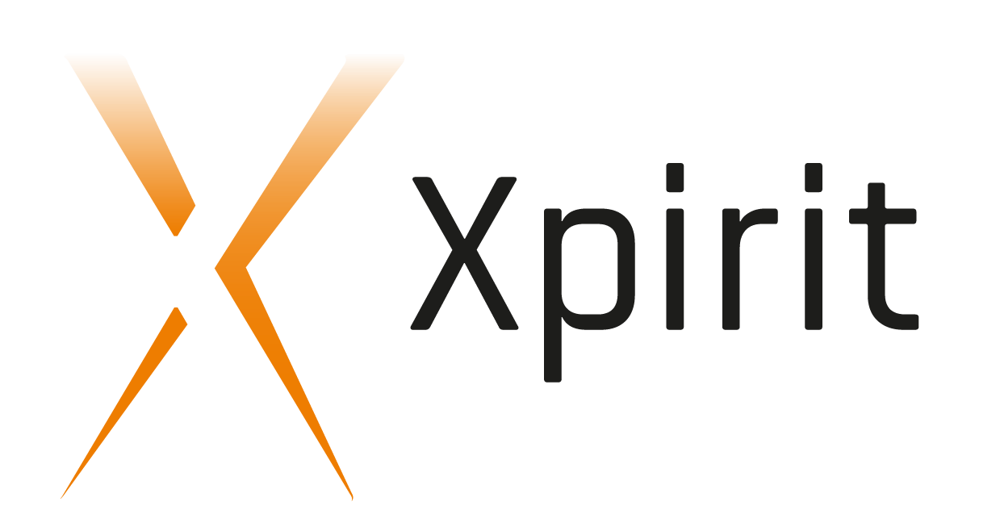</div></center>
<br />
<center>
<table>
  <tr>
    <td>**Slides**</td><td>[http://nauts.io/workshop-azure-container-services](http://nauts.io/workshop-azure-container-services)</td>
  </tr>
</table>
</center>

!SLIDE
### Azure Container Service 
<center></center>

!SLIDE
### Azure Container Service DC/OS

!SUB
### Mesos
creates a single Operating System Kernel spanning all machines.
<center></center>

!SUB
### Marathon
the init system of Mesos. It will make sure that you will keep your applications running.
<center></center>

!SUB
### mesos-dns
provides DNS based service discovery of deployed applications.
<center></center>

!SUB
### marathon-lb
provides routing and load balancing functionality to deployed applications.
<center>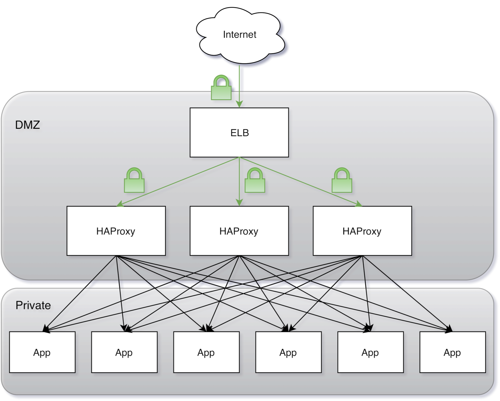</center>

!SUB
### Chronos
the cron subsystem of Mesos. It will allow you to periodically execute jobs.
<center>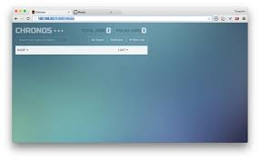</center>

!SLIDE
### Hands-on 
- generic instruction, try to solve it yourself
- are you stuck? press 's' and check the presenter notes for typing instructions

### Prerequisites
- Microsoft Azure trial account > 20 cores quote
- Docker Machine installed
- putty / ssh-agent installed


!SLIDE
### The hands-on scene
This is your end result today!
<center>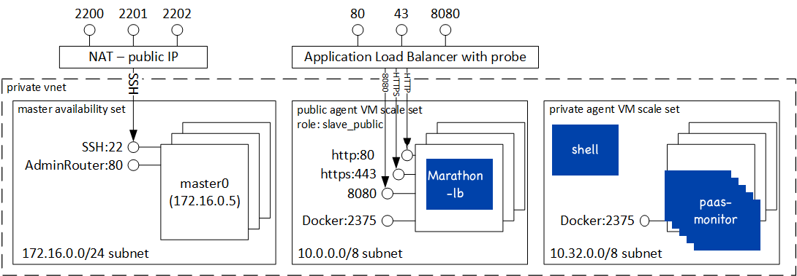</center>

!SUB
### paas monitor application
A web application that continuously calls a backend service. Each instance of 
the deployed service that responds results in an new row.
instances that have been killed, will remain in the table until a refresh. The environment 
variables 'RELEASE' and 'MESSAGE' can be set to mimick new 
application releases.
<center>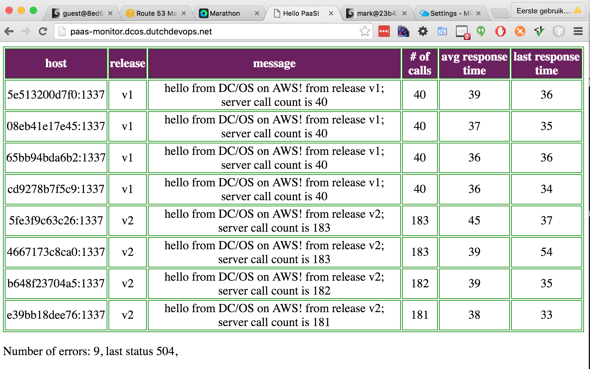</center>

!SUB
### shellinabox application
A web application that gives access to an interactive shell. the environment
variables 'SIAB_USER' and 'SIAB_PASSWORD' allow you to set the username
and password with which you can log in. network utilities have been installed
so that you can do DNS lookups. 
<center>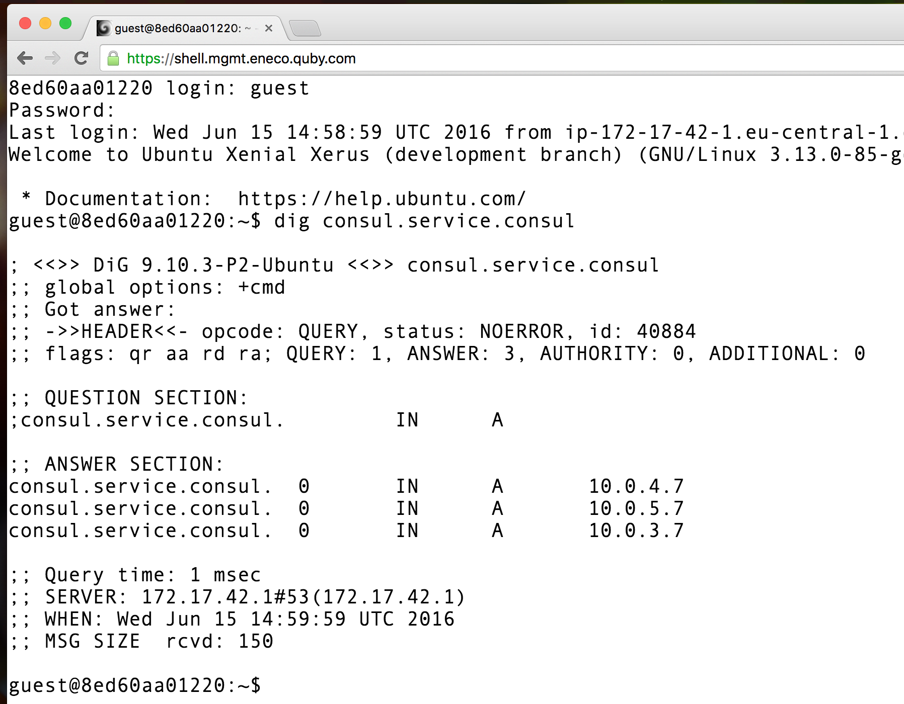</center>

!SLIDE
### Hands-on
- local applications
  - paas-monitor 
  - shellinabox 
- Setup a Azure Container Service 
  - Install marathon-lb package
  - Deploy paas-monitor
  - Rolling upgrade paas-monitor
  - Service discovery
  - Deploy ASP.net Core application
  - Scaling

!SLIDE
### Local paas-monitor application

<p style="font-size: 80%">
paas-monitor is a small docker application that allows you to see
the effect of rolling upgrades, scaling, failures etc. the environment variables
'RELEASE' and 'MESSAGE' can be used to mimick new application releases.
<br/>
<hr/>
<p style="font-size: 80%">
** Assignment : **
run the docker image mvanholsteijn/paas-monitor:latest  on your local machine and point your browser to it.
 what do you see? what happens if you stop the paas-monitor?
</p>

<center>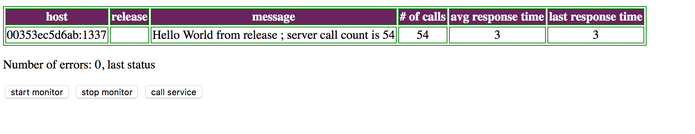</center>
</p>


!NOTE
- docker-machine create -d virtualbox  dev
- eval $(docker-machine env dev)
- docker run -d --publish :1337:1337 --env "RELEASE=v1" --env "MESSAGE=hello from docker machine." mvanholsteijn/paas-monitor:latest
- open http:$(echo $DOCKER_HOST |cut -d: -f2):1337
- docker stop $(docker ps -ql)

!SLIDE
### Local shellinabox application

<p style="font-size: 80%">
shellinabox provides a shell with a web interface so you
can safely snoop around on a machine. The environment variables 'SIAB_USER' and 'SIAB_PASSWORD' 
allow you to set the username and password with which you can log in.  The environment variable 'SIAB_SSL'  controls
encrytion by the shell.
<br/>
<hr/>
</p>
<p style="font-size: 80%">
** Assignment : **
run the docker image [mvanholsteijn/shellinabox:latest](https://github.com/mvanholsteijn/shellinabox-container) on your local machine and point your browser to it.
disable SSL and specify a username and password. Login through the web interface and look around.
</p>


!NOTE
- docker run -d --publish :4200:4200 -e SIAB_SSL=false -e SIAB_USER=guest -e SIAB_PASSWORD=password -e SIAB_SUDO=true mvanholsteijn/shellinabox:latest
- open http:$(echo $DOCKER_HOST |cut -d: -f2):4200
- docker stop $(docker ps -ql)

!SLIDE
### Deploy ACS - DC/OS
<p style="font-size: 80%">
** Assignment : **
goto the  [Azure Portal](https://portal.azure.com/) and create a DC/OS test cluster
</p>
<center>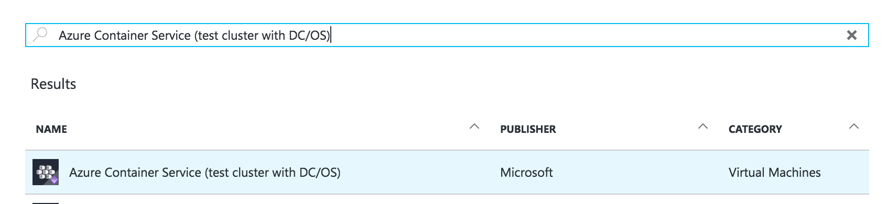</center>


!NOTE
- goto [Azure Portal](https://portal.azure.com/), 
- Click New
- Search 'Azure Container Service (test cluster with DC/OS)'
- Click Create 
- Do a basic configuration in West Europe
See [Deploy an ACS Cluster](https://azure.microsoft.com/en-us/documentation/articles/container-service-deployment/) for full details.


!SUB
### Connect to ACS - DC/OS
<p style="font-size: 75%">
** Assignment: **
Point your browser to the DC/OS console via an SSH tunnel to your mesos master machine at &lt;username>@&lt;dns-prefix>mgmt.westeurope.cloudapp.azure.com. 
the diagram below shows you the deployment diagram of your cluster. The public DNS names is your configured prefix postfixed with mgmt.westeurope.cloudapp.azure.com and agents.westeurope.cloudapp.azure.com for the management and agent machines respectively.

<center></center>
</p>

!NOTE
- sudo ssh -p 2200 -i $HOME/.ssh/id_rsa -N -L 80:localhost:80 <cuser>@<dns-prefix>mgmt.westeurope.cloudapp.azure.com -
- open http://localhost

See [Connect to ACS cluster](https://azure.microsoft.com/en-us/documentation/articles/container-service-connect/) for full details.


!SUB
### Explore the Console
<p style="font-size: 75%">
** Assignment: **
Explore the DC/OS consoles: http://localhost, http://localhost/marathon and http://localhost/mesos. How many machines can you find in the cluster? How much resources does Mesos have available in total?
</p>
<center>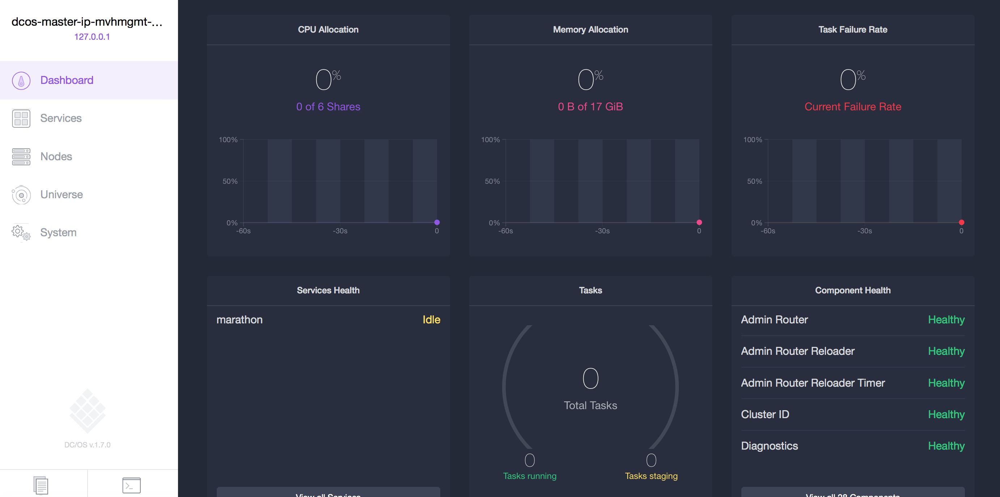</center>

!SLIDE
### Install the marathon loadbalancer
<p style="font-size: 75%">
** Assignment: **
On the console, goto the DC/OS Universe and install the marathon-lb with 0.5 cpu and 256Mb memory.
</p>
<center>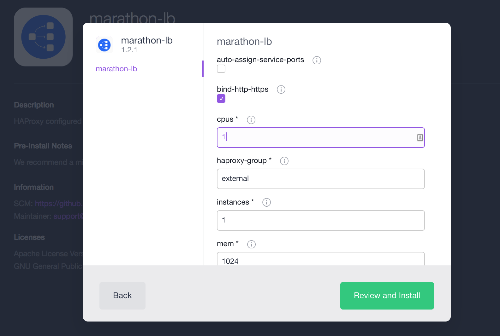</center>


!NOTE
- Click on Universe
- Search marathon-lb
- Click 'Advanced Installation'
- Set cpus to 0.5
- Set memory to 256
- Click review and install.

!SLIDE
### Deploy the paas-monitor
<p style="font-size: 75%">
** Assignment: **
Deploy the paas-monitor docker application using [marathon UI](http://localhost/marathon) configured to handle requests for http://paas-monitor.&lt;public-ip-agent-lb>.xip.io.  with 0.25 cpu, 128 mb memory. Add a health check on /status with reasonable timeout for a fast application.
point your browser at the deployed application and scale up and scale down using the console.

<center>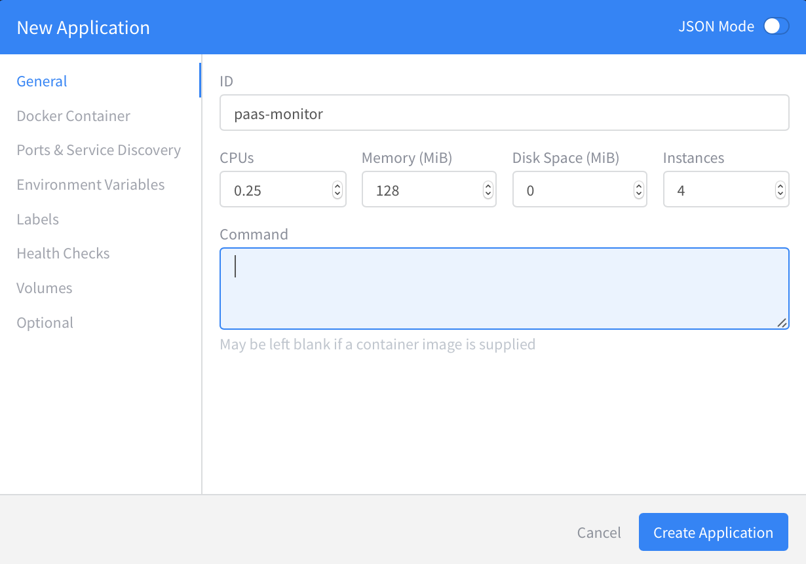</center>
</p>


!NOTE
- goto http://localhost/marathon
- set Id to 'paas-monitor'
- set CPUs, Memory, Disk and Instances to 0.24, 128, 0 and 1 respectively
- set Docker Container to 'mvanholsteijn/paas-monitor:latest' 
- set Network to 'BRIDGE'
- set Container Port to 1337
- set Environment variables RELEASE=v2 and MESSAGE=hello azure
- set label HAPROXY_GROUP to external
- set label HAPROXY_0_VHOST to paas-monitor.&lt;public-ip-agent>.xip.io
- set Health Check Path to /health with a grace = 30s, interval = 10s and timeout = 2s
- Your json should look something like this [marathon task definition definition](https://raw.githubusercontent.com/mvanholsteijn/paas-monitor/master/marathon.json)

to scale up use the console
- goto http://localhost/marathon
- select  'paas-monitor'
- Click 'Scale Application'
- Increase / decrease and watch the effect in your browser


!SUB
### Upgrading the application
<p style="font-size: 75%">
** Assignment: **
Change the paas-monitor configuration environment variable RELEASE to v2.1. Redeploy this version
and watch the behaviour of the application in the browser and in the marathon ui. What strategy does marathon take?

<center></center>
</p>


!SUB
### Rolling upgrade
<p style="font-size: 75%">
Marathon provides different [upgradeStrategies](https://mesosphere.github.io/marathon/docs/rest-api.html). 
</p>
<p style="font-size:75%">
** Assignment: **
Configure the application to do a rolling upgrade of instances to RELEASE=v3.  Watch the behaviour of the application in the browser and in the marathon ui. 
How does this compare to the previous upgrade?
</p>


!NOTE
Editing upgrade strategies is no part of the UI yet. Use JSON mode to insert the definition.

- goto http://localhost/marathon
- select  'paas-monitor'
- Click 'Edit'
dcos-agent-private-4D3DE637-vmss0
- Click 'JSON Mode'
- Change "RELEASE" value to "v3"
- Paste the following text into the definition:
```
  ,"upgradeStrategy": { "minimumHealthCapacity": 1.0, "maximumOverCapacity": 0.0 }
```


!SLIDE
### Service Discovery - Marathon-dns
<p style="font-size: 75%">
marathon-dns has registered A and SRV DNS records for paas-monitor. See [marathon-dns service naming](https://mesosphere.github.io/mesos-dns/docs/naming.html) for dtetails.
</p>
<p style="font-size:75%">
** Assignment: **
Deploy the shellinabox and use dig to find the DNS A and SRV records for paas-monitor.
</p>


!NOTE
- goto http://localhost/marathon
- Add application
- set Id to 'shell'
- set CPUs, Memory, Disk and Instances to 0.25, 128, 0 and 1 respectively
- set Docker Container to 'mvanholsteijn/shellinabox:latest' 
- set Network to 'BRIDGE'
- set Container Port to 4200
- set env SIAB_SSL to false
- set env SIAB_USER  
- set env SIAB_PASSWORD  
- set label HAPROXY_GROUP to external
- set label HAPROXY_0_VHOST shell.&lt;public-ip-agent>.xip.io
- set Health Check Path to / with a grace = 30s, interval = 10s and timeout = 2s
- Your json should look something like this [marathon task definition definition](https://raw.githubusercontent.com/mvanholsteijn/shellinabox-container/master/marathon.json)
- point your browser at http://shell.&lt;public-ip-agent>.xip.io and login with $SIAB_USER and $SIAB_PASSWORD
- type: dig paas-monitor.marathon.mesos
- type: dig _paas-monitor._tcp.marathon.mesos


!SLIDE
### Scaling machines
Marathon will automatically reschedule applications when machines go down.
<p style="font-size: 75%">
** Assignment: ** Scale the public virtual machine scaling set to 2 and the private to 5. How many resources does Mesos now report?
scale the number of marathon-lb instances to 2. Scale the number of paas-monitor instances to 10. 
Perform a shutdown of a machine in the private scaling set. How fast does it recover?

Advanced topic: We did not get to this either :-)
</p>

!NOTE
Scaling the VMSS is pretty difficult..
- goto [https://github.com/.../201-vmss-scale-existing](https://github.com/Azure/azure-quickstart-templates/tree/master/201-vmss-scale-existing)
- Click on 'Deploy to Azure'
- Fill in the name of the private scaling set 'dcos-agent-private-&lt;magic-number>-vmss0' and scale to 5
- Repeat the procedure for the public scaling set 'dcos-agent-public-&lt;magic-number>-vmss0' and scale to 2
- scale the paas-monitor to 10 instances
- reduce the private scaling set 'dcos-agent-private-&lt;magic-number>-vmss0' to 2 instances
- reduce the public scaling set 'dcos-agent-private-&lt;magic-number>-vmss0' to 1 instance


!SLIDE
<center><div style="width: 75%; height: auto;"></div></center>
